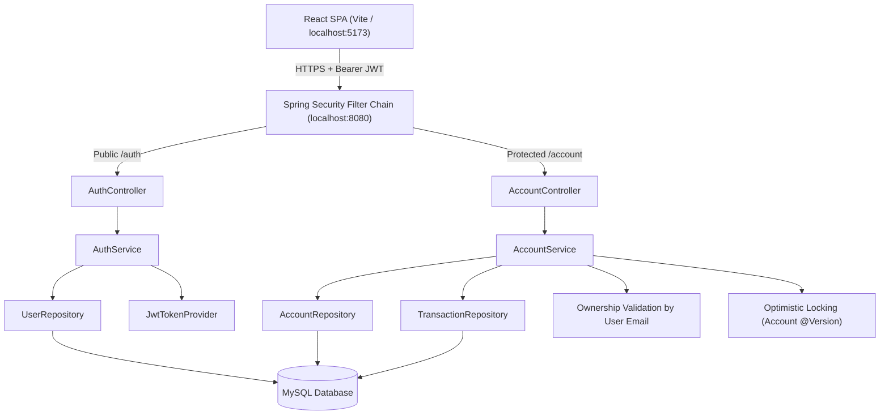

# Online Banking System (Full-Stack)

A modern, production-grade Online Banking System built with a **React JS (Vite)** frontend and a **Spring Boot (Java 17)** REST API backend, backed by **MySQL** for data persistence.

---

## 📂 Project Structure

The project is structured as a monorepo containing distinct directories for the client application and the API service:

* **`/backend`**: The Spring Boot backend. Exposes JWT-secured REST endpoints, validates banking rules (balances, transfers, authentication), and interfaces with the MySQL database.
* **`/frontend`**: The React Single Page Application (SPA). Built with Vite and customized Vanilla CSS, featuring a glassmorphic dark-theme dashboard.
* **`/docs`**: Architectural, security, and API documentation files.

---

## 🏗️ Architecture



---

## 🚀 Build and Run Instructions

### 1. Database Setup
Ensure you have MySQL running locally and create a database named `online_banking`:
```sql
CREATE DATABASE online_banking;
```

### 2. Configure & Run Backend
Navigate to the `backend` folder and set the required environment variables:
```bash
# Navigate to the backend
cd backend

# Set environment variables (Windows PowerShell examples)
$env:DB_USERNAME="your_mysql_username"
$env:DB_PASSWORD="your_mysql_password"
$env:JWT_SECRET="base64_encoded_256_bit_or_stronger_secret" # e.g. MDEyMzQ1Njc4OTAxMjM0NTY3ODkwMTIzNDU2Nzg5MDE=

# Start the application
mvn spring-boot:run
```
*The backend API will start on `http://localhost:8080`.*

### 3. Configure & Run Frontend
Navigate to the `frontend` folder, install packages, and start the development server:
```bash
# Navigate to the frontend
cd ../frontend

# Install dependencies
npm install

# Start Vite server
npm run dev
```
*The frontend application will start on `http://localhost:5173`.*

---

## 📖 API Documentation & Swagger

* **Interactive Swagger UI**: Once the backend is running, you can test and view endpoints at:
  `http://localhost:8080/swagger-ui.html`
* **Additional Documentation**:
  * [Project Documentation](docs/PROJECT_DOCUMENTATION.md)
  * [API Endpoint Reference](docs/API_DOCUMENTATION.md)
  * [Security Design Notes](docs/SECURITY.md)

---

## 🛠️ Main REST Endpoints Summary

### Authentication
* `POST /api/auth/register` - Create a new user account.
* `POST /api/auth/login` - Login to receive a signed JWT bearer token.

### Account Management (JWT Required)
* `POST /api/account/create` - Open a checking account with an optional initial balance.
* `GET /api/account/my-accounts` - Retrieve all accounts owned by the authenticated user.
* `GET /api/account/{id}` - Retrieve a specific account's details (checks ownership).

### Transactions (JWT Required)
* `POST /api/account/deposit` - Deposit money into a checking account.
* `POST /api/account/withdraw` - Withdraw money from a checking account (checks balance constraints).
* `POST /api/account/transfer` - Transfer money from an owned account to any recipient account.
* `GET /api/account/transactions/{accountId}` - Retrieve a paginated transaction history ledger.

---

## 📊 Database Schema

```sql
CREATE TABLE users (
    id BIGINT AUTO_INCREMENT PRIMARY KEY,
    name VARCHAR(255) NOT NULL,
    email VARCHAR(255) NOT NULL UNIQUE,
    password VARCHAR(255) NOT NULL,
    role VARCHAR(255) NOT NULL
);

CREATE TABLE accounts (
    id BIGINT AUTO_INCREMENT PRIMARY KEY,
    account_number VARCHAR(255) NOT NULL UNIQUE,
    balance DECIMAL(38,2) NOT NULL,
    version BIGINT,
    user_id BIGINT NOT NULL,
    FOREIGN KEY (user_id) REFERENCES users(id)
);

CREATE TABLE transactions (
    id BIGINT AUTO_INCREMENT PRIMARY KEY,
    type VARCHAR(255) NOT NULL,
    amount DECIMAL(38,2) NOT NULL,
    timestamp DATETIME NOT NULL,
    account_id BIGINT NOT NULL,
    target_account_id BIGINT,
    FOREIGN KEY (account_id) REFERENCES accounts(id)
);
```
