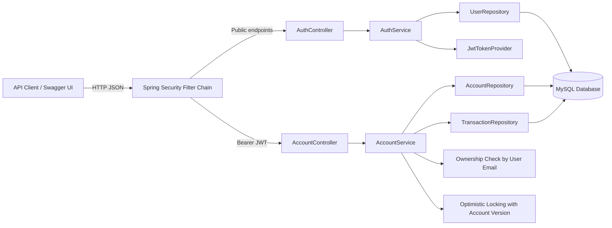

# Online Banking System API

A production-level Online Banking System backend built with Java 17, Spring Boot, Spring Security (JWT), and MySQL.

## Architecture



## Documentation

- [Project Documentation](docs/PROJECT_DOCUMENTATION.md)
- [API Documentation](docs/API_DOCUMENTATION.md)
- [Security Notes](docs/SECURITY.md)

## Build and Run

1. Make sure MySQL is running and create a database named `online_banking`.
   ```sql
   CREATE DATABASE online_banking;
   ```
2. Set the required environment variables.
   ```bash
   DB_USERNAME=your_mysql_username
   DB_PASSWORD=your_mysql_password
   JWT_SECRET=base64_encoded_256_bit_or_stronger_secret
   ```
   Example JWT secret generation:
   ```bash
   openssl rand -base64 32
   ```
3. Build the project:
   ```bash
   mvn clean install
   ```
4. Run the application:
   ```bash
   mvn spring-boot:run
   ```
The application will start on `http://localhost:8080`.

## Swagger Documentation

Once the app is running, navigate to the Swagger UI to view and test all endpoints:
`http://localhost:8080/swagger-ui.html`

## Sample JSON Requests & Responses

### 1. User Registration
`POST /api/auth/register`
**Request:**
```json
{
  "name": "John Doe",
  "email": "johndoe@example.com",
  "password": "password123"
}
```
**Response (201 Created):**
```text
User registered successfully!
```

### 2. User Login
`POST /api/auth/login`
**Request:**
```json
{
  "email": "johndoe@example.com",
  "password": "password123"
}
```
**Response (200 OK):**
```json
{
  "accessToken": "eyJhbGciOiJIUzI1NiJ9...",
  "tokenType": "Bearer"
}
```
*Note: Include this access token in the `Authorization` header for all protected endpoints (`Bearer <token>`).*

### 3. Create Account
`POST /api/account/create`
**Request:**
```json
{
  "initialBalance": 1000.00
}
```
**Response (201 Created):**
```json
{
  "id": 1,
  "accountNumber": "AC3F9B1E2D",
  "balance": 1000.00,
  "userName": "John Doe"
}
```

### 4. Deposit Money
`POST /api/account/deposit`
**Request:**
```json
{
  "accountId": 1,
  "amount": 500.00
}
```
**Response (200 OK):**
```json
{
  "id": 1,
  "accountNumber": "AC3F9B1E2D",
  "balance": 1500.00,
  "userName": "John Doe"
}
```

### 5. Withdraw Money
`POST /api/account/withdraw`
**Request:**
```json
{
  "accountId": 1,
  "amount": 200.00
}
```
**Response (200 OK):**
```json
{
  "id": 1,
  "accountNumber": "AC3F9B1E2D",
  "balance": 1300.00,
  "userName": "John Doe"
}
```

### 6. Transfer Money
`POST /api/account/transfer`
**Request:**
```json
{
  "fromAccountId": 1,
  "toAccountId": 2,
  "amount": 300.00
}
```
**Response (200 OK):**
```json
{
  "id": 1,
  "accountNumber": "AC3F9B1E2D",
  "balance": 1000.00,
  "userName": "John Doe"
}
```

### 7. Get Transaction History
`GET /api/account/transactions/1?page=0&size=10`
**Response (200 OK):**
```json
{
  "content": [
    {
      "id": 1,
      "type": "TRANSFER",
      "amount": 300.00,
      "timestamp": "2023-10-25T14:30:22.123",
      "accountNumber": "AC3F9B1E2D",
      "targetAccountId": 2
    }
  ],
  "pageable": { ... },
  "last": true,
  "totalPages": 1,
  "totalElements": 1,
  "size": 10,
  "number": 0,
  "first": true,
  "numberOfElements": 1,
  "empty": false
}
```

## Database Schema (Automatically Generated by Hibernate)

```sql
CREATE TABLE users (
    id BIGINT AUTO_INCREMENT PRIMARY KEY,
    name VARCHAR(255) NOT NULL,
    email VARCHAR(255) NOT NULL UNIQUE,
    password VARCHAR(255) NOT NULL,
    role VARCHAR(255) NOT NULL
);

CREATE TABLE accounts (
    id BIGINT AUTO_INCREMENT PRIMARY KEY,
    account_number VARCHAR(255) NOT NULL UNIQUE,
    balance DECIMAL(38,2) NOT NULL,
    version BIGINT,
    user_id BIGINT NOT NULL,
    FOREIGN KEY (user_id) REFERENCES users(id)
);

CREATE TABLE transactions (
    id BIGINT AUTO_INCREMENT PRIMARY KEY,
    type VARCHAR(255) NOT NULL,
    amount DECIMAL(38,2) NOT NULL,
    timestamp DATETIME NOT NULL,
    account_id BIGINT NOT NULL,
    target_account_id BIGINT,
    FOREIGN KEY (account_id) REFERENCES accounts(id)
);
```
